# Delivery Oracle 기획서

## 프로젝트 기간
2024.06.10 ~ 2024.07.18  
팀원 총 3명 (Frontend 1명, Backend 1명, FullStack 1명)

**사용한 기술 스택**  
- Frontend: React  
- Backend: Spring Boot  
- Database: MySQL  
- ETC: SourceTree, Jira

## 프로젝트 개요
Delivery Oracle은 배달 플랫폼으로 웹 사이트로 제작된 배달 플랫폼입니다.  
소비자, 음식점, 라이더, 관리자 기능이 담겨 있으며 각 기능은 아래 표와 같습니다.  

## ERD
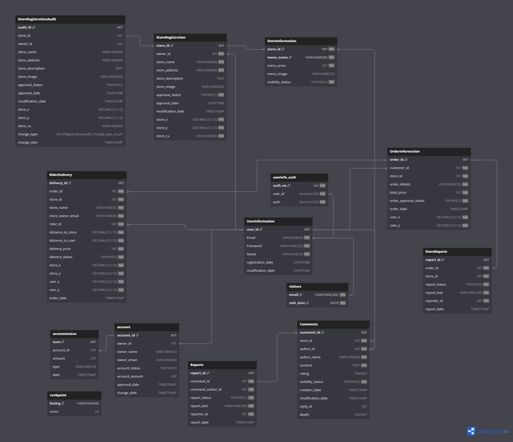

## API
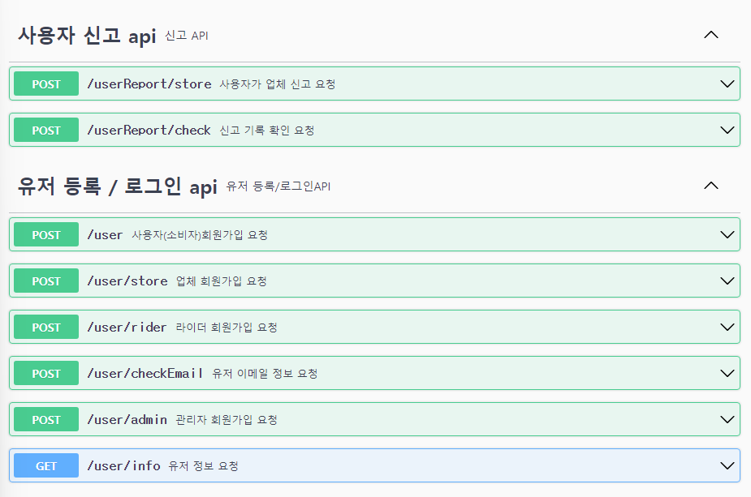  
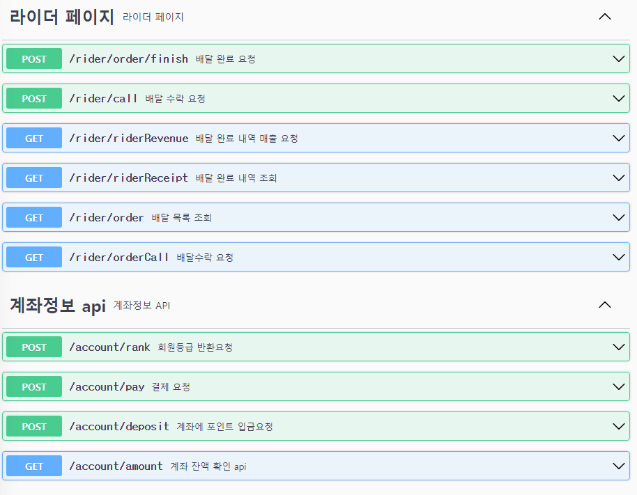  
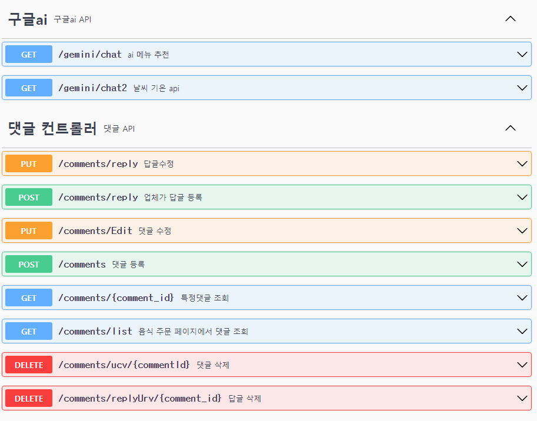  
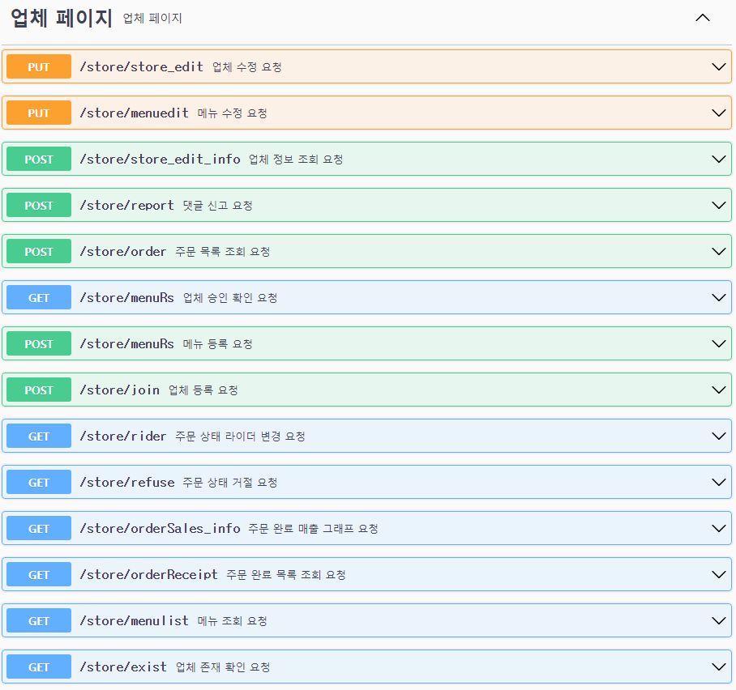  
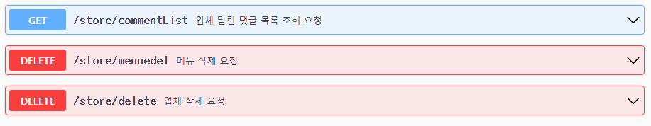  
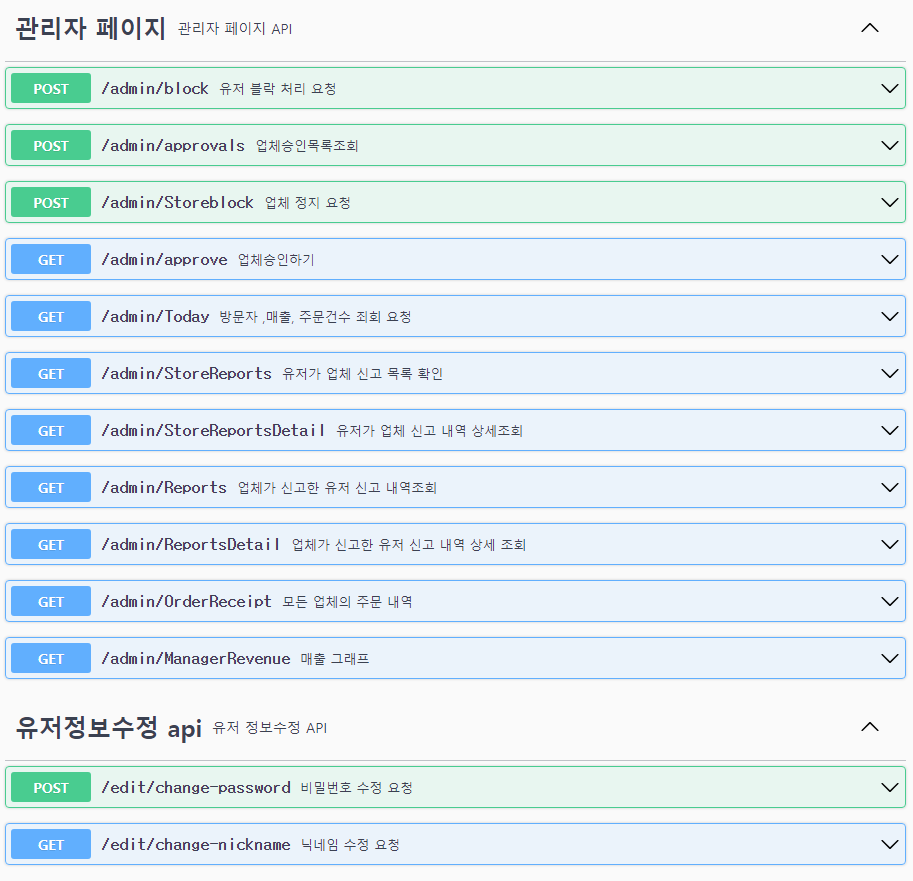  
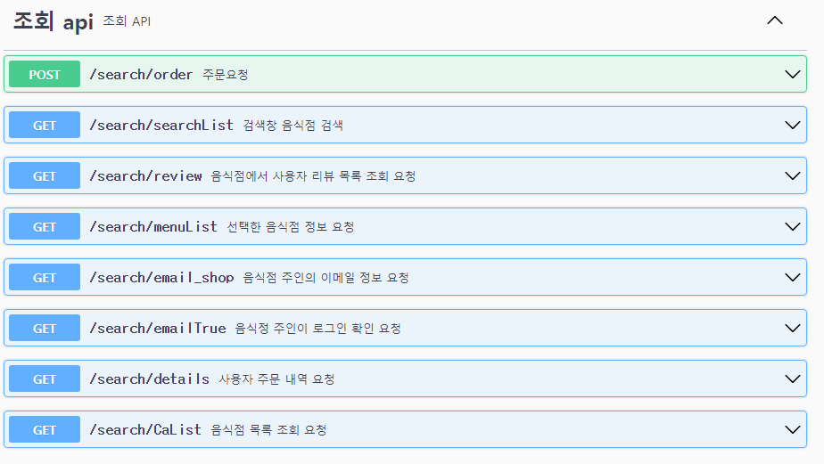  
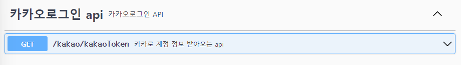

## 구현 기능

### 유저
- **사용자 회원가입**: 이메일, 닉네임, 비밀번호를 이용하여 로그인
- **로그인**: 로그인 성공 시 JWT 토큰 발급
- **OAuth 로그인**: 카카오 로그인 구현  
  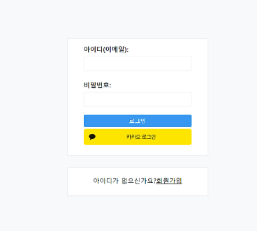
- **사용자의 주문 금액에 따른 등급 부여**  
  | 등급      | 총액            |
  |-----------|-----------------|
  | Bronze    | 0               |
  | Silver    | 10,000 <= X     |
  | Gold      | 50,000 <= X     |
  | Platinum  | 100,000 <= X    |
- **포인트 충전**
- **음식 주문**: 현재 보인 위치 주변의 음식점만 검색 가능  
  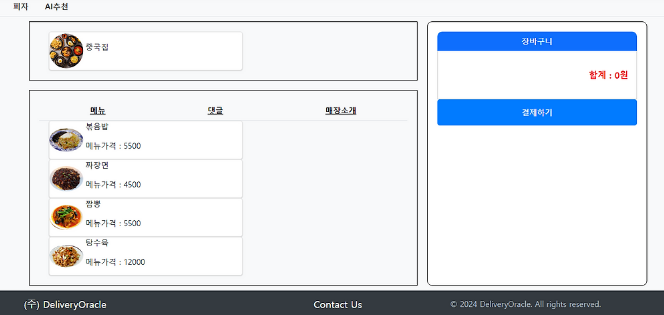
- **주문한 음식 결과 보기**  
  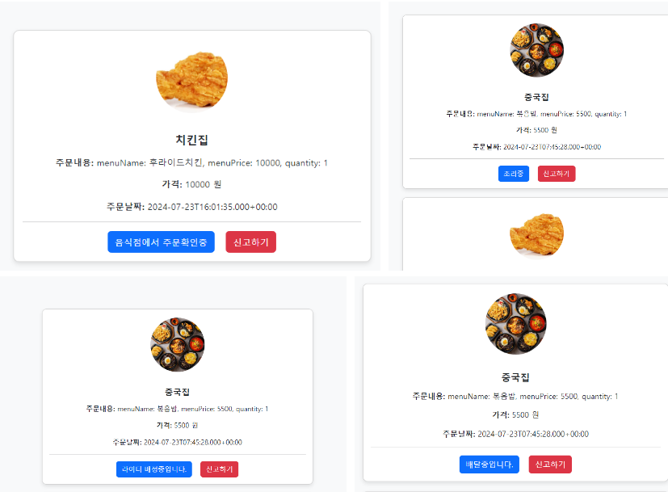
- **배달 완료된 음식 리뷰 작성**  
  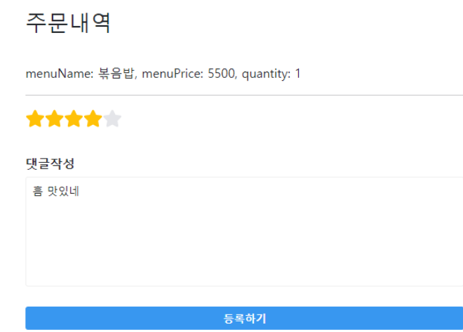
- **업체 신고 기능**

### 업체
- **업체 등록**
- **메뉴 등록**
- **유저가 주문하면 주문내역 확인 가능**
- **주문 상태를 '조리하기', '거절', '라이더 배정'으로 상태 변경 가능** (이는 유저 쪽에서도 변경된 상태를 확인)  
  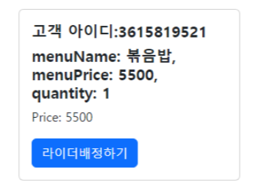
- **유저가 작성한 평가에 대한 답글 작성**
- **악성 유저 신고**
- **총 주문 내역 확인**
- **매출 그래프**
- **업체 관리 내용 수정, 메뉴 수정**

### 라이더
- **현재 자기 위치 주변으로 콜 받기 기능**
- **주변에 있는 콜 중에서 본인이 원하는 콜 선택 가능** (이때 거리에 따른 배달 가격은 변화하며, 주문자와의 거리 및 가게와의 거리가 나타남)  
  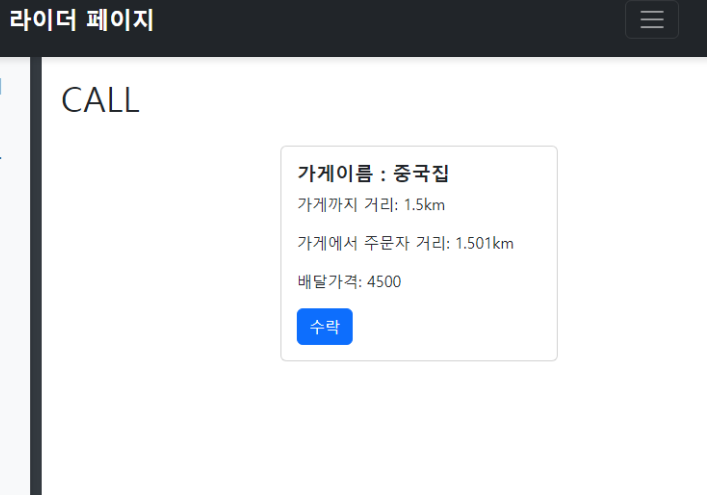  
  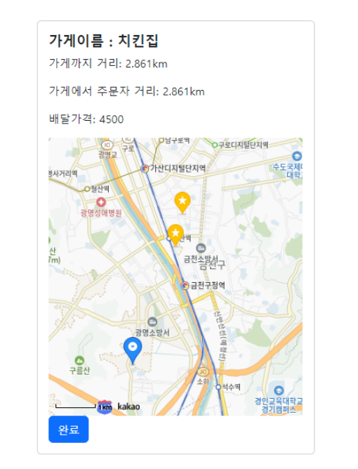
- **배달을 수락하면 업체와 유저한테 '배달 중'이라고 표시**
- **완료 내역/매출 내역 확인 가능**

### 관리자
- **업체가 등록하면 관리자에서 승인해야 업체 이용 가능**
- **신고된 업체 퇴출 기능** (신고 내용 또한 확인 가능)
- **악성 이용자 차단**  
  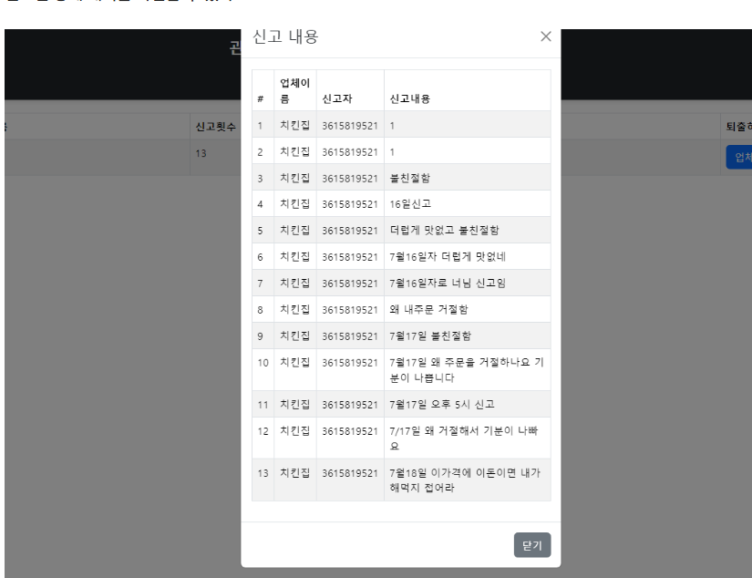

### AI 주문 추천 시스템
- 구글 제미나이를 이용한 음식 추천 시스템
- 사용자의 주문 기록과 날씨 기반 데이터를 이용하여 사용자에 맞게 음식을 추천  
  | 회차  | 계절 기반과 날씨 기반 / 주문내역 기반 | 주문내역이 없는 경우 날씨 기반 추천 |
  |-------|-------------------------------------|---------------------------------|
  | 1회차 | 66.12% / 28%                        | 84.67%                          |
  | 2회차 | 61.86% / 18.36%                     | 83.95%                          |
  | 3회차 | 60.98% / 19.52%                     | 79.36%                          |  
  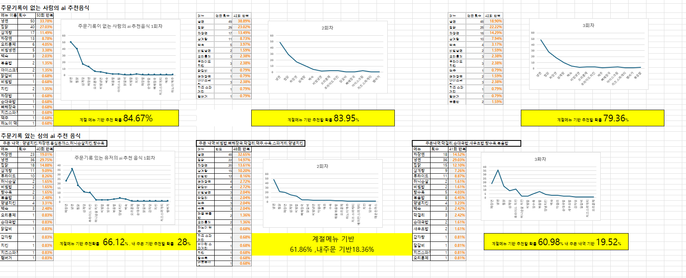

## 느낀점
6주간의 프로젝트에서 팀원 3명과 함께 비전공자로 구성된 팀으로 프로젝트를 진행했습니다. 제가 어릴 때부터 게임 개발을 하면서 개발 공부를 조금 한 경험이 있어, 팀장 역할을 맡지는 않았지만, 프로젝트의 전반적인 계획과 필요한 기능들을 제가 틀을 잡고 시작했습니다. 프로젝트는 사용자 페이지, 업체 페이지, 관리자 페이지, 라이더 페이지로 구성되어 있으며, JWT를 이용한 권한 분리도 구현했습니다.

### 주요 역할과 기여
프로젝트에서 제가 맡은 주요 항목은 다음과 같습니다:
- **유저 페이지**: 유저 페이지, 업체 목록 조회, 업체 검색, 음식 주문, 유저 계좌 잔액 충전, 업체 신고하기, 카카오 로그인, 구글 AI로 메뉴 추천
- **업체 페이지**: 업체 등록, 메뉴 등록, 댓글 관리, 현재 주문 상태 확인, 유저 신고하기, 메뉴 수정/삭제
- **관리자 페이지**: 신고받은 유저 차단하기, 신고받은 업체 차단하기
- **라이더 페이지**: 라이더 메인 페이지, 주문받기, 배달 등록하기, 배달 완료하기
- **공통**: JWT를 이용한 권한 나누기 및 로그인 시 적용

프로젝트의 프런트엔드와 백엔드 대부분의 코드와 틀을 제가 맡아 진행했습니다.

이렇게 많은 역할을 하게 된 이유는 팀원 두 분이 프로젝트를 처음 경험하고 코딩을 접한 지 3개월 된 상황이었기 때문입니다. 처음에는 이분들이 전체 작업량의 40%를 담당하기로 했으나, 코드 작성에 익숙하지 않아 작업이 매우 느리게 진행되었습니다. 그래서 제가 그들의 작업까지 맡게 되었고, 대부분의 백엔드 코드와 프론트엔드 틀 잡는 작업을 제가 하게 되었습니다.

이 과정에서 다음과 같은 트러블이 발생했습니다:
- **팀원들의 자존심 문제**: 제가 많은 작업을 맡게 되면서, 팀원들의 작업을 제가 대신하는 상황이 빈번해졌습니다. 이는 팀원들의 자존심에 영향을 미쳐, 일부 갈등이 발생했습니다.
- **업무 배분 문제**: 팀원들이 맡은 작업을 기한 내에 완성하지 못하자, 작업 분담에 대한 불만과 책임 소재에 대한 논의가 필요하게 되었습니다.

이를 해결하기 위해서:
- **커뮤니케이션 강화**: 팀원들과의 원활한 소통을 위해 주기적으로 미팅을 열어 진행 상황을 공유하고, 서로의 어려움을 이해하려고 노력했습니다. 특히, 제가 많은 작업을 맡게 된 이유와 팀원들의 성장과 학습을 돕기 위한 제 역할을 설명했습니다.
- **역할 분담 재조정**: 각 팀원의 역량에 맞게 역할을 다시 분담했습니다. 코딩에 익숙하지 않은 팀원들에게는 문서 작업, 테스트, 디버깅 등의 업무를 맡기고, 비교적 간단한 기능 구현을 하도록 유도했습니다. 이렇게 팀원들이 단계적으로 실력을 향상할 수 있도록 하였습니다.

이러한 조치 덕분에 팀원들 고의 갈등을 해소하고, 팀원들 또한 처음에는 기능 하나 만드는데 1주 정도 걸리던 팀원들이 2일에서 3일 만에 기능 하나씩 만들 수 있을 정도로 성장하면서 프로젝트를 성공적으로 마무리할 수 있었습니다.

# 상세 설명
[프로젝트 상세 블로그 링크](https://yuuki0930.tistory.com/122)
